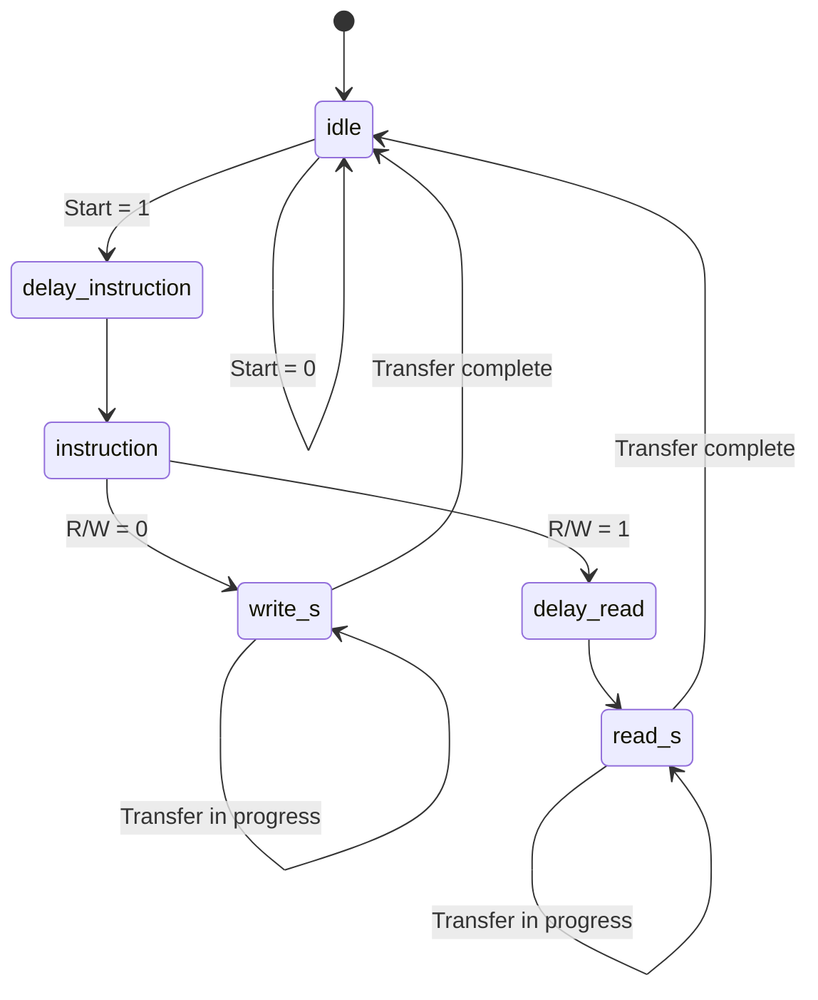

# FPGA-Based AD9117 DAC Controller in VHDL

This repository contains a VHDL implementation of an FPGA-based controller interface for the **AD9117 DAC**.  
The FPGA is programmed to configure and drive the AD9117 through:

- an **SDIO-based SPI interface** for DAC register configuration
- a **14-bit parallel DDR interface** for transferring digital data to the DAC

The design was implemented in VHDL and verified using a dedicated VHDL testbench.

---

## Overview

The main goal of this project is to program an FPGA to communicate with and drive an **AD9117 digital-to-analog converter**.

The FPGA controls the communication, while the AD9117 is the external DAC device.  
Before sending parallel digital data to the DAC, the FPGA configures the AD9117 internal registers through an SPI-like serial interface.

Unlike a conventional SPI interface with separate `MOSI` and `MISO` lines, the AD9117 serial interface uses a single bidirectional `SDIO` line. In this design, the FPGA controls the direction of `SDIO` depending on whether the current SPI transaction is a write or read operation.

After the configuration phase, the FPGA sends digital I/Q data to the AD9117 through a 14-bit parallel DDR data bus.

---

## Repository Structure

```text
.
├── Master.vhdl
├── Master_tb.vhdl
├── datasheet/
│   └── AD9117.pdf
└── README.md
```

| File | Description |
|---|---|
| `Master.vhdl` | Main VHDL design for the FPGA-based AD9117 controller interface |
| `Master_tb.vhdl` | VHDL testbench used to verify the design |
| `docs/datasheets/AD9117.pdf` | AD9117 DAC datasheet used as the hardware reference |
| `README.md` | Project documentation |

> Note: The VHDL source file names are kept as they were in the original project.

---

## Hardware Reference

This design is based on the **AD9117 DAC** interface requirements described in its datasheet.

The datasheet is included in:

```text
docs/datasheets/AD9117.pdf
```

It is used as the reference for:

- SDIO-based SPI register configuration
- instruction byte format
- register addressing
- 14-bit parallel DAC data interface
- DDR-style I/Q data transfer
- DAC clock forwarding requirements

---

## Main Features

- FPGA controller interface for the AD9117 DAC
- SDIO-based SPI controller for AD9117 register configuration
- Support for SPI read and write transactions
- Configurable SPI transfer size from 1 to 4 data bytes
- MSB-first instruction and data transfer
- Active-low chip select control
- Bidirectional SDIO line with tri-state handling
- 14-bit parallel DAC data interface
- DDR-style I/Q data forwarding using ODDR primitives
- Forwarded DAC clock generation
- VHDL testbench for functional verification

---

## SPI Interface for AD9117 Configuration

The AD9117 is configured through an SPI-like serial interface.  
Each SPI transaction starts with an 8-bit instruction byte followed by up to 32 bits of data.

```text
[39:32]  Instruction Byte
[31:0]   Data Payload
```

The instruction byte determines the transaction type, the number of transferred data bytes, and the target register address.

```text
DB7     DB6     DB5     DB4     DB3     DB2     DB1     DB0
R/W     N1      N0      A4      A3      A2      A1      A0
```

| Field | Description |
|---|---|
| `R/W` | Selects read or write transaction |
| `N1:N0` | Selects the number of data bytes |
| `A4:A0` | Selects the target AD9117 register address |

The `N1:N0` field determines the transfer size:

| `N1:N0` | Data Bytes |
|---|---|
| `00` | 1 byte |
| `01` | 2 bytes |
| `10` | 3 bytes |
| `11` | 4 bytes |

---

## SDIO Direction Control

The AD9117 SPI interface uses a single bidirectional serial data line.  
Therefore, the FPGA must switch the `SDIO` line between output and input modes.

During write transactions, the FPGA drives `SDIO` and sends configuration data to the AD9117.  
During read transactions, the FPGA releases `SDIO` and samples incoming data from the DAC.

```vhdl
SDIO <= Tx when RW_CTL_INT = '0' else 'Z';
```

This tri-state control prevents bus contention and allows the same physical line to be used for both read and write operations.

---

## SPI Finite State Machine

The SPI controller is implemented as a finite state machine.  
The FSM controls the instruction phase, read and write data phases, chip select signal, bit counter, and SDIO direction.



### FSM States

| State | Role |
|---|---|
| `idle` | Waits for the start of a new SPI transaction |
| `delay_instruction` | Prepares the first instruction bit and activates the transaction |
| `instruction` | Sends the 8-bit instruction byte |
| `write_s` | Sends configuration data from the FPGA to the AD9117 |
| `delay_read` | Releases the SDIO line before a read transaction |
| `read_s` | Reads incoming data from the AD9117 through SDIO |

---

## Parallel DAC Data Interface

After the AD9117 is configured through SPI, the FPGA provides digital data through a 14-bit parallel interface.

The parallel interface uses DDR-style forwarding, where I-channel and Q-channel data are transferred on opposite clock edges. Since the AD9117 data bus is 14 bits wide, the design uses 14 parallel ODDR instances, one for each output bit.

A forwarded DAC clock is also generated using an ODDR primitive, allowing the AD9117 to sample the parallel data with the required timing relationship.

---

## Testbench

The included testbench verifies the main behavior of the design, including:

- system clock generation
- SPI clock generation
- start signal generation
- AD9117 SPI write transactions
- AD9117 SPI read transactions
- different SPI transfer lengths
- SDIO behavior during read and write operations
- parallel DDR data forwarding behavior

---

## Tools

| Tool / Language | Purpose |
|---|---|
| VHDL | Hardware description |
| Xilinx Vivado | Design and simulation |
| Vivado Simulator | Functional verification |
| Xilinx 7-Series FPGA primitives | ODDR-based DDR forwarding |

---

## Notes

This project demonstrates how an FPGA can be programmed to configure and drive an AD9117 DAC using VHDL.  
It covers SDIO-based SPI control, bidirectional bus handling, FSM-based protocol control, and DDR-style parallel data forwarding.

The included datasheet is provided only as a reference document for understanding the target DAC interface.

---